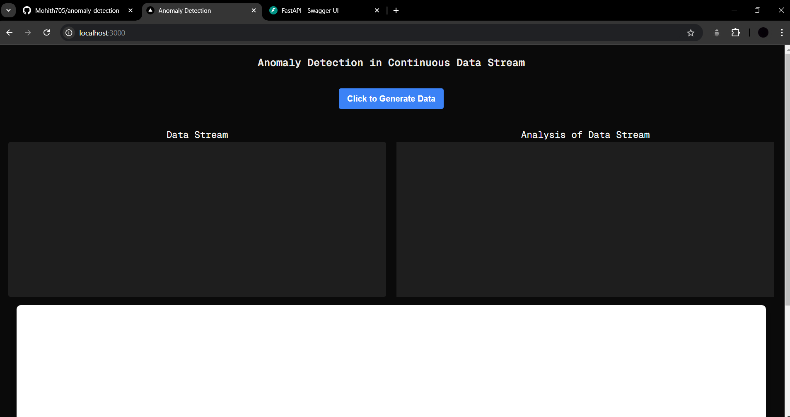
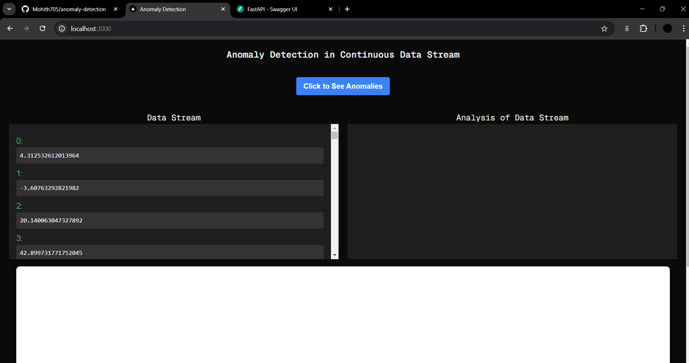
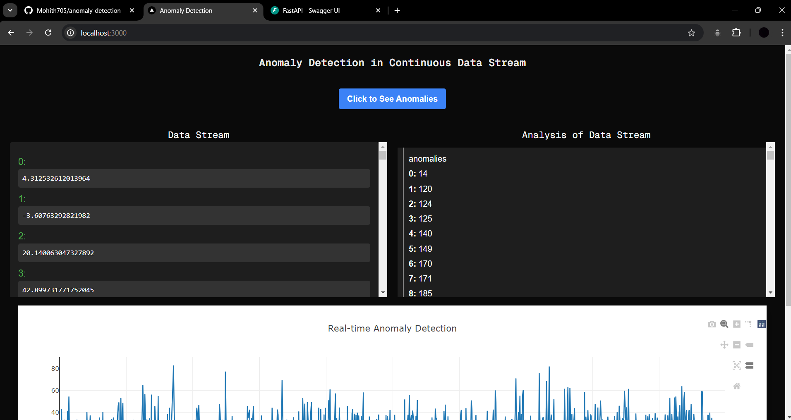
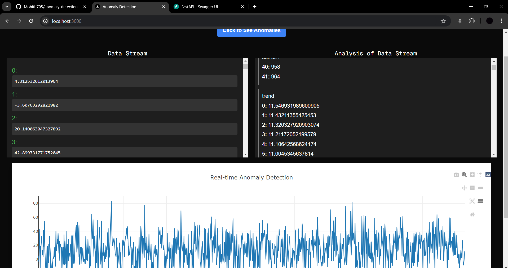

# 🚨 Anomaly Detection System (Images of website are provided below)

Welcome to the **Anomaly Detection System**! This project is designed to monitor and detect anomalies in streaming data using advanced algorithms and real-time processing. Here’s everything you need to know about the system and how to get started.

## 🚀 Features

- **Real-Time Monitoring**: Continuously track data streams for unusual patterns.
- **Customizable Thresholds**: Adjust sensitivity settings according to your needs.
- **Detailed Analysis**: View detailed information and statistics related to detected anomalies.
- **Interactive Dashboard**: Navigate through a user-friendly web interface to monitor and analyze data.

## 🎯 Objective

The goal of this system is to provide early detection of unusual patterns or anomalies in streaming data, which can be crucial for timely interventions in various applications like fraud detection, system health monitoring, or market analysis.

## 🔧 Setup

At the start:
- **Data Input**: Configure the source of your data streams.
- **Anomaly Detection**: Set up detection rules and thresholds.

## 🔄 Data Processing Flow

- Data is streamed continuously into the system.
- Each data point is analyzed in real-time to detect deviations from normal patterns.
- Detected anomalies trigger alerts and are logged for further analysis.

## ✔️ Technologies Used

- **Frontend**: **Next.js, Tailwind CSS** for the dashboard.
- **Backend**: Python with **FastAPI** for API services.
- **Machine Learning**: Python libraries such as scikit-learn for anomaly detection algorithms.

## 📦 Installation

To set up the system locally:

1. **Clone the repository**:

    ```bash
    git clone [https://github.com/Mohith705/21BCE7511_BayyaMohith.git](https://github.com/Mohith705/anomaly-detection.git)
    ```

2. **Navigate to the project directory**:

    ```bash
    cd anomaly-detection
    ```

3. **Install backend dependencies**:

    ```bash
    cd backend
    python -m venv env
    env\Scripts\Activate
    pip install -r requirements.txt
    ```

4. **Install frontend dependencies**:

    ```bash
    cd ../frontend
    npm install
    ```

5. **Start the backend server**:

    ```bash
    fastapi dev
    ```

6. **Start the frontend application**:

    ```bash
    npm run dev
    ```

## 🖼️ Dashboard Screenshots

### 1. Main Dashboard - The main interface of the system(Initial UI):



*The main dashboard showing real-time data and alerts.*

### 2. Data Generation:



*Details of the alerts triggered by the system.*

### 3. After Detecting Anomalies - Displayed on analysis box:



*Interface for configuring anomaly detection thresholds and rules.*

### 4. Detailed Analysis - Detailed view of detected anomalies:



*Detailed analysis of anomalies detected by the system.*

## 📜 License

This project is licensed under the MIT License - see the [LICENSE](LICENSE) file for details.

## 📫 Contact

For any inquiries or feedback, please reach out to me at [bayyamohith32@gmail.com](mailto:bayyamohith32@gmail.com).

---
Leverage the power of real-time anomaly detection to safeguard your operations! 🚨
